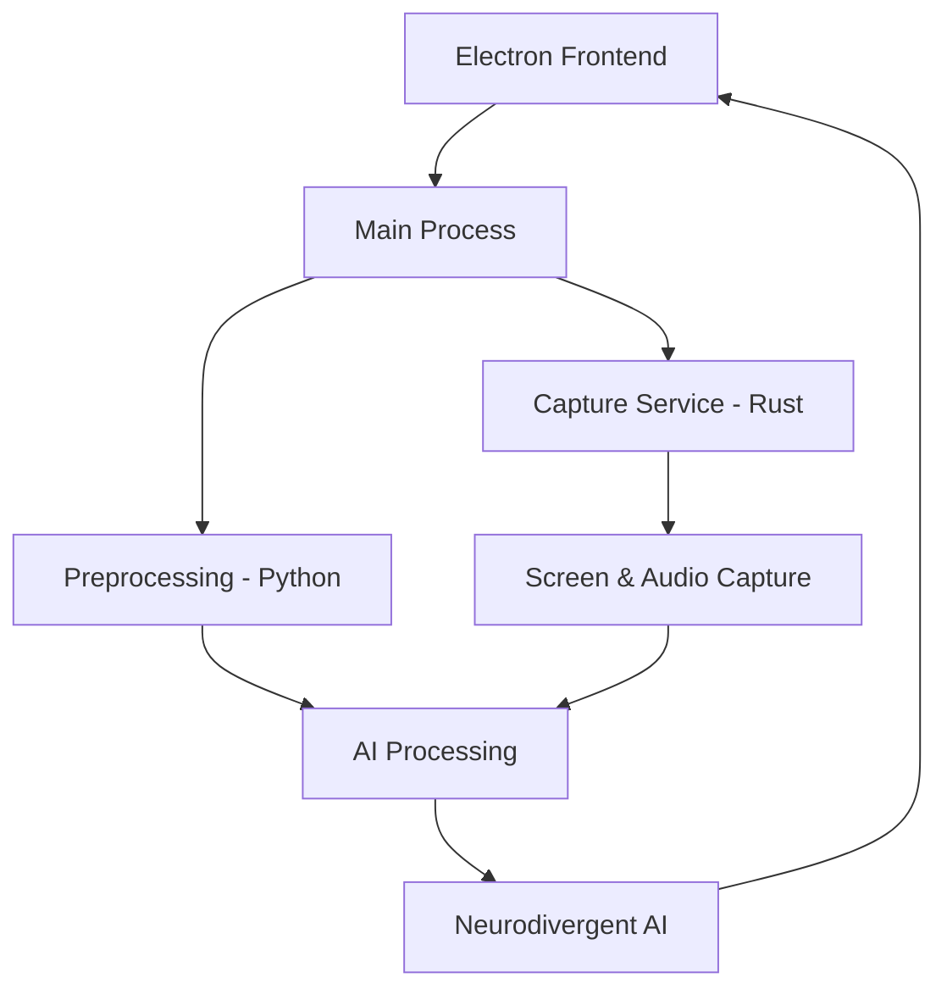

# velvet-app

Velvet - Neurodivergent AI Assistant

## ✨ About Velvet

<div align="center">
  
Velvet is a **neurodivergent-friendly AI assistant** designed to provide soft support for sharp minds. Built with modern technologies and accessibility in mind, Velvet offers a seamless experience for users who think differently.

</div>

## 🛠️ Tech Stack

<div align="center">

<!-- Skill Icons -->

<br/>


</div>

## 📊 GitHub Stats

<div align="center">

<!-- GitHub Stats -->
<a href="https://github.com/Fayeq-qamar/velvet-app">
  
</a>
<a href="https://github.com/Fayeq-qamar/velvet-app">
  
</a>

</div>

## 🚀 Features

<table align="center">
  <tr>
    <td align="center" width="33%">
      
      <br/>
      <strong>AI-Powered Assistance</strong>
      <p>Advanced AI capabilities with neurodivergent-friendly interactions</p>
    </td>
    <td align="center" width="33%">
      
      <br/>
      <strong>Accessibility First</strong>
      <p>Designed with neurodivergent users in mind from the ground up</p>
    </td>
    <td align="center" width="33%">
      
      <br/>
      <strong>Cross-Platform</strong>
      <p>Built with Electron for seamless desktop experience</p>
    </td>
  </tr>
  <tr>
    <td align="center" width="33%">
      
      <br/>
      <strong>Voice Integration</strong>
      <p>Advanced audio processing with Whisper and custom capture</p>
    </td>
    <td align="center" width="33%">
      
      <br/>
      <strong>Real-time Processing</strong>
      <p>Low-latency screen and audio capture services</p>
    </td>
    <td align="center" width="33%">
      
      <br/>
      <strong>Modular Architecture</strong>
      <p>Multi-service design with Rust, Python, and JavaScript</p>
    </td>
  </tr>
</table>

## 🏗️ Architecture

<div align="center">



</div>

## 📦 Installation

<div align="center">

```bash

# Clone the repository
git clone https://github.com/Fayeq-qamar/velvet-app.git
cd velvet-app

# Install dependencies
npm install

# Build TypeScript
npm run build:ts

# Start in development mode
npm run dev
```

</div>

## 🎯 Quick Start

<table>
  <tr>
    <td width="50%">
      <h3>Development Mode</h3>
      <pre><code>npm run dev</code></pre>
      <p>Starts Velvet in development mode with hot reload</p>
    </td>
    <td width="50%">
      <h3>Safe Mode</h3>
      <pre><code>npm run dev-safe</code></pre>
      <p>Runs with minimal modules for debugging</p>
    </td>
  </tr>
</table>

## 🔧 Services

<div align="center">

| Service | Language | Purpose |
|---------|----------|---------|
| **Main App** | JavaScript/Electron | Desktop interface and coordination |
| **Capture Service** | Rust | High-performance screen/audio capture |
| **Preprocessing** | Python/FastAPI | AI model integration and processing |

</div>

## 🤝 Contributing

<div align="center">

We welcome contributions! Velvet is built for and by the neurodivergent community.

```bash

# Fork the repository

# Create a feature branch

# Make your changes

# Submit a pull request
```

</div>

## 📝 License

<div align="center">

Velvet App is released under the **MIT License** - see the [LICENSE](LICENSE) file for details.

</div>

## 🌟 Support

<div align="center">

If you find Velvet helpful, please consider giving it a ⭐ on GitHub!

<a href="https://github.com/Fayeq-qamar/velvet-app">
  
</a>

</div>

<div align="center">

<!-- Gradient Wave Footer -->


</div>

